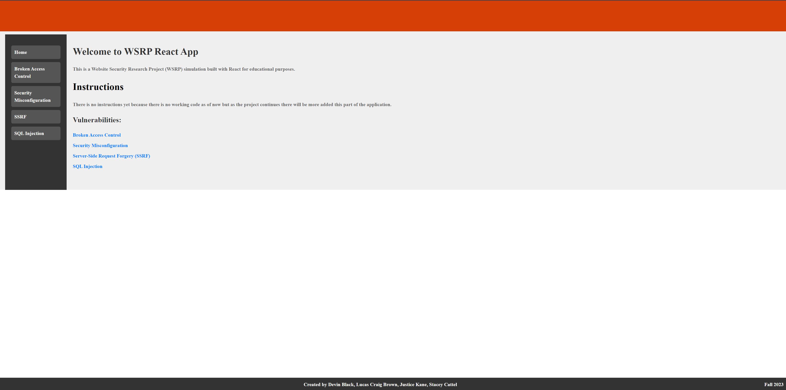

# CS461
Repo for our CS461 capstone project - Website Security Research Project.

-There is now a folder for the frontend and backend. 
-Added a Cheat sheet for Git commands, this will be in the parent directory

-We will be using Postman to run test, those will be kept in the test folder.
 that way we can all run the same test as we create them. 

Currently to run this locally, move into the correct directory and type

    - python index.py

Then invagate to http://localhost:5000
