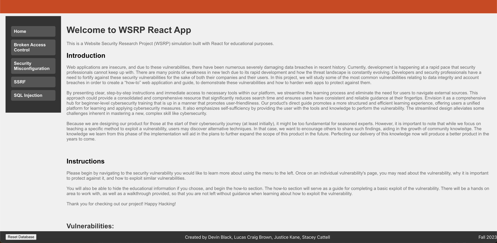

# CS462

Repo for our CS462 capstone project - Website Security Research Project.

- Clone the project repository to your local machine.

- Ensure the database connections are configured correctly:

- Within the project files, two database connections are specified. It is crucial to comment or uncomment these connections as needed:

  - The first connection, located at the top of a configuration file, is designed for SQLAlchemy.
  - The second connection, found within the insecure_user_search functionality, is intended for demonstrating SQL injection vulnerabilities.

  Both connections are clearly labeled to guide which should be enabled for the project's requirements.

- Navigate to the project's root directory using your terminal or command prompt.

- Launch the project by typing the following command:

  - docker-compose up --build

  This command builds and starts the Docker containers necessary for the project.

- Once the Docker containers are up and running, open a web browser and navigate to 'http://localhost:3000' to access the project's homepage.

- Locate and click the "Reset Database" button in the footer of the webpage. This action initializes or resets the database, ensuring the application is ready for use.

- The site is now operational locally and can be explored to investigate various website security aspects.

By following these instructions, you will have successfully set up the Website Security Research Project locally, enabling a hands-on exploration of security practices and vulnerabilities within a web application context.

